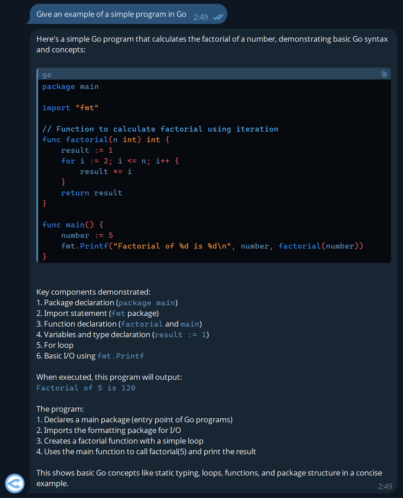

<h1 align="center">
    
    <div>
    OpenRouter
    <br>
    Bot
    </div>
</h1>

This project allows you to quickly and free launch your Telegram bot to communicate with cloud AI via [OpenRouter](https://openrouter.ai) for you and your family.

> [!NOTE]
> This repository is a fork of the [openrouter-gpt-telegram-bot](https://github.com/deinfinite/openrouter-gpt-telegram-bot) project, which adds `Markdown` formatting to bot responses and optimizes the process of launching in a container.

<details>
    <summary>Example Markdown formatting</summary>
    
</details>

## Preparation

- Register with [OpenRouter](https://openrouter.ai) and get an [API key](https://openrouter.ai/settings/keys).

- Create your Telegram bot using [@BotFather](https://telegram.me/BotFather) and get its API token.

- Get your telegram id using [@getmyid_bot](https://t.me/getmyid_bot).

> [!TIP]
> When you launch the bot, you will be able to see the IDs of other users in the log, to whom you can also grant access to the bot in the future.

## Launch

- Create a working directory:

```bash
mkdir openrouter-bot
cd openrouter-bot
```

- Create `.env` file and fill in the basic variables:

```bash
# OpenRouter api key
API_KEY=
# Free modeles: https://openrouter.ai/models?max_price=0
MODEL=deepseek/deepseek-r1:free
# Telegram api key
TELEGRAM_BOT_TOKEN=
# Your Telegram id
ADMIN_IDS=
# List of users to access the bot, separated by commas
ALLOWED_USER_IDS=
# Disable guest access
GUEST_BUDGET=0
# Language used for bot responses (supported: EN/RU)
LANG=EN
```

The list of all parameters is listed in the `.env.example` file.

- Download the image from [Docker Hub](https://hub.docker.com/r/lifailon/openrouter-bot) and run the container:

```bash
docker run -d --name OpenRouter-Bot \
    -v ./.env:/openrouter-bot/.env \
    --restart unless-stopped \
    lifailon/openrouter-bot:latest
```

The image is build for `amd64` and `arm64` platforms using [docker buildx](https://github.com/docker/buildx).

## Build

```bash
git clone https://github.com/Lifailon/openrouter-bot
cd openrouter-bot
docker-compose up -d --build
```
